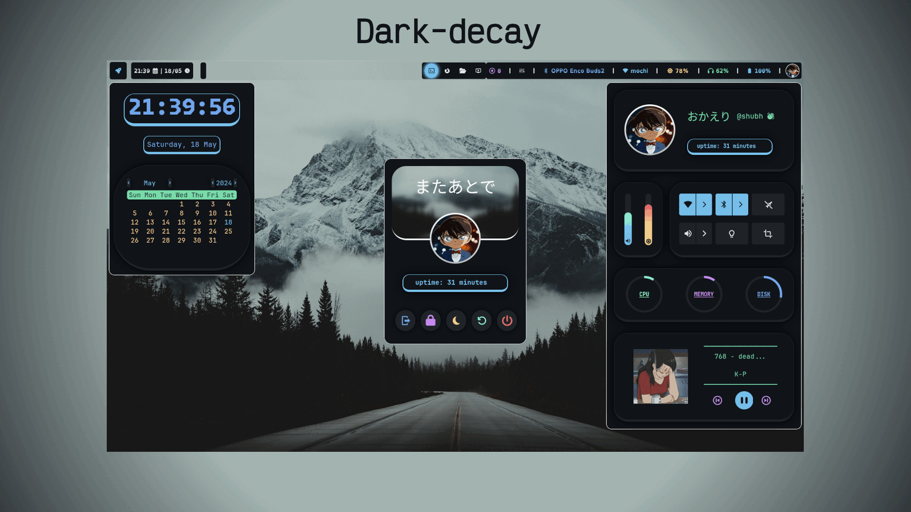

<h1 align="center">🪺 HyprNest 🪺: Hyprland Rice 🍚 for my Arch Linux System.</h1>

### Info:
+ Wayland Compositor🔲 : [Hyprland](https://github.com/hyprwm/Hyprland).
+ Bar🍫 : [Waybar](https://github.com/Alexays/Waybar).
+ Lockscreen🔒 : [Hyprlock](https://github.com/hyprwm/hyprlock).
+ Wallpaper utility🌅 : [swww](https://github.com/LGFae/swww) with [Waypaper](https://github.com/anufrievroman/waypaper).
+ Launcher🚀 :  [rofi-lbonn-wayland](https://aur.archlinux.org/packages/rofi-lbonn-wayland-git).
+ Widgets : [Eww](https://github.com/elkowar/eww).
+ Terminal💻 : [kitty](https://github.com/kovidgoyal/kitty).
+ Shell🐚 : ```zsh``` with [Starship prompt](https://starship.rs/).
+ Text Editor📝 : [Neovim](https://neovim.io/).
+ Browser🌐 : [Firefox](https://www.mozilla.org/en-US/firefox/new/).
+ Audio Visualiser🎵 : [cava](https://github.com/karlstav/cava).
+ File Manager📂 : [Thunar](https://docs.xfce.org/xfce/thunar/start).
+ Notification Daemon: [dunst](https://github.com/dunst-project/dunst)

### Colorschemes:


***Note: Currently, the colorscheme-changer changes colors for kitty, waybar, hyprlock and eww widgets.***
### Installation:

#### **Prerequisites**:

+ Arch Linux; may also work on a Arch-based distribution [not tested].
+ ```sudo``` privileges.
+ Active internet connection.

#### **Manual Install**:

1. Install an AUR Helper: An AUR helper simplifies the installation of AUR packages. (eg, [yay](https://github.com/Jguer/yay), [paru](https://github.com/Morganamilo/paru)).

2. Make sure you have already enabled ```networkmanager``` and ```bluetooth``` services.
3. Install the following packages with your aur helper:


```
jq ripgrep alsa-utils sof-firmware pipewire wireplumber pipewire-alsa pipewire-pulse brightnessctl blueman hyprland hyprlock waybar xdg-utils xdg-user-dirs rofi-lbonn-wayland-git kitty neovim wl-clipboard thunar thunar-volman tumbler gvfs thefuck grim slurp swayimg gtk3 libdbusmenu-glib libdbusmenu-gtk3 gtk-layer-shell dunst playerctl ffmpeg vlc gammastep lsd starship fastfetch cava btop swww waypaper firefox ttf-jetbrains-mono-nerd ttf-victor-mono-nerd adobe-source-han-sans-jp-fonts otf-opendyslexic-nerd nwg-look gradience
```

4. Clone the following zsh-plugins in your ```~/.local/share/zsh-plugins``` directory (make one, if directory already not present):
+ [zsh-syntax-highlighting](https://github.com/zsh-users/zsh-syntax-highlighting)
+ [zsh-autosuggestions](https://github.com/zsh-users/zsh-autosuggestions)
+ [supercharge](https://github.com/zap-zsh/supercharge)
  
```Note: (zsh-plugin installation is optional; if you don't want them: just remove the lines that source those plugins in the ~/.zshrc)```

5. Clone this repo and copy everything under ```.config``` and ```Pictures```(optional) directory to your .config and Picures directory:

```
git clone https://github/com/d-shubh./HyprNest.git
cd HyprNest
cp -r .config/* $HOME/.config/
cp -r Pictures $HOME
cp .zshrc $HOME
```
5. Reboot your system. And... your are done ;-)

#### Install via script:
+ Clone this repository change into the `HyprNest` directory:
```
git clone https://github.com/d-shubh/HyprNest.git
cd Hyprnest
```
+ Make the Script Executable: 
``` 
chmod +x install.sh
```
+ Run the Script:
```
./install.sh
```
+ Follow On-Screen Prompts: The script may prompt you for confirmation or input during the installation process. Read and follow the prompts carefully.
+ Reboot your system after the script finishes its execution and... you are done ;-)


## Future changes:
- [ ] Replace ```eww``` with ```ags``` (eww caused me issues in some ways it shouldn't T_T )
- [ ] same for ```waybar``` (so... less dependencies?)

### Side notes:
+ You might also want to configure the gtk theme using:
  + [nwg-look](https://github.com/nwg-piotr/nwg-look): a GTK3 settings editor, designed to work properly in wlroots-based Wayland environment.
  + [Gradience](https://github.com/GradienceTeam/Gradience?tab=readme-ov-file): a tool for customizing Libadwaita applications and the adw-gtk3 theme.
+ Gtk theme used in the video showcase is [decay-gtk](https://github.com/decaycs/decay-gtk).

### ✨ Special thanks to:
+  [@vaxerski](https://github.com/vaxerski) for creating [Hyprland](https://github.com/hyprwm/Hyprland).
+  [r/unixporn](https://www.reddit.com/r/unixporn/), got inspiration from a bunch of rices posted there!!!
